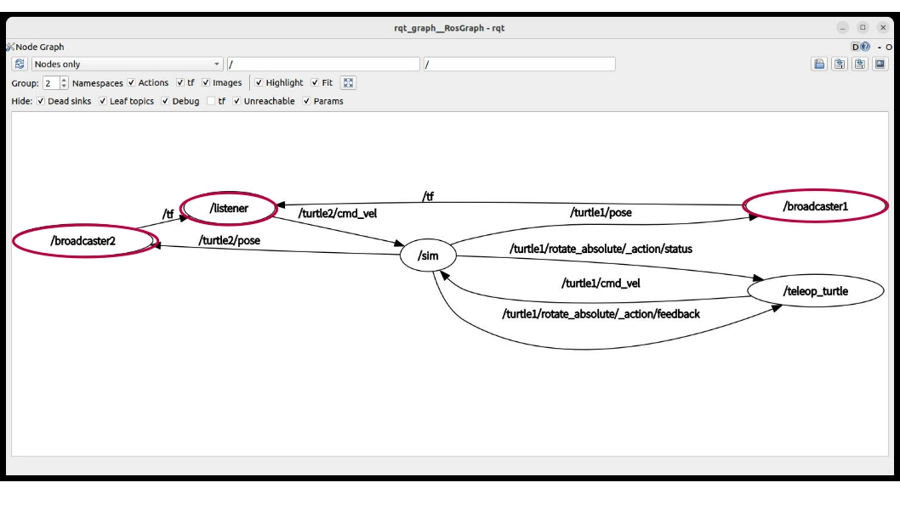

# [tf2 소개](https://docs.ros.org/en/humble/Tutorials/Intermediate/Tf2/Introduction-To-Tf2.html)
1. 목표
1. 사전준비
1. 실습
1. 데모 설명
1. tf2 tools
1. rviz와 tf2

## 목표
* turtlesim을 활용한 multi-robot 예제에서 tf2 기능 살펴보기.
## 사전준비
demo package와 dependencies 설치.

```bash
sudo apt-get install ros-humble-turtle-tf2-py ros-humble-tf2-tools ros-humble-tf-transformations
```

## 실습
### 데모 실행
새로운 터미널을 실행한 후, ROS2 설치를 source하고 다음 명령어를 실행한다.

```bash
ros2 launch turtle_tf2_py turtle_tf2_demo.launch.py
```


위 사진과 같이 두 개의 turtle이 실행되는 것을 볼 수 있다.
새로운 터미널을 실행한 후 다음 명령어를 실행한다.
```bash
ros2 run turtlesim turtle_teleop_key
```


위 사진처럼, 키보드를 이용해 하나의 turtle을 움직여보면, 또 다른 turtle이 따라오는 것을 확인 할 수 있다. 

## 데모 설명
* 배경 지식
  * Frame: 로봇의 위치/방향을 측정하는 기준 (xy 좌표계, xyz 좌표계)
    
    [이미지 출처: https://foxglove.dev/blog/understanding-ros-transforms](https://foxglove.dev/blog/understanding-ros-transforms)

    * Red arrow (X축) / Red arrow (Y축) / Green arrow (Z축)    * 
    * 기준점과 좌표축을 어디에 두느냐에 따라 무수히 많은 frame이 존재한다
      * World frame (or map frame): 공간 좌표계 (3인칭 시점)
      * Robot frame (base_link): 로봇의 위치를 기준으로 하는 좌표계
        * "turtle1" frame: turtle1의 입장에서 바라본 좌표계
        * "turtle2" frame: turtle2의 입장에서 바라본 좌표계
        * ...
      * Sensor frame: 로봇에 부착된 센서를 기준으로 하는 좌표계
      * ...
    * 서로 다른 frame 사이에는 연관성이 있다
      * World frame은 모든 frame의 상위 프레임이다
      * Robot frame은 해당 로봇에 부착된 Sensor frame의 부모 frame이다
      * "turtle1" frame과 "turtle2" frame은 둘 다 world frame의 자식 framd이다 
      * Turtle2가 Turtle1을 따라가려면?
        * Turtle1의 위치를 Turtle2 기준으로 바꿔서 표현해야 한다
          * Src frame: "world" frame or "turtle1" frame
          * Dest frame: "turtle2" frame
  * Transform: 한 frame을 기준이 되는 다른 frame (reference frame)으로 표현하는 것
    * ex) 로봇팔에 부착된 manipulator의 위치를  world frame 상의 좌표로 표현할 수 있다
  
  * tf2: ROS2에서 frame 간 변환 기능을 제공하는 라이브러리 
* ROS graph 구조
   
  * tf2 library는 3개의 프레임(world, turtle1, turtle2)을 생성한다. 
  * tf2 broadcaster("/broadcaster1", "/broadcaster2")는 turtle들의 프레임을 publish한다.
  * tf2 listener ("/listener")는 두 프레임 사이의 차이를 계산하고, 하나의 turtle을 움직여 다른 turtle을 따라가도록 한다. 

## tf2 tools
tf2_tools을 활용하여 tf2가 이 데모에서 어떻게 사용되고 있는지 살펴보자.

### 1. view_frames 사용해보기
view_frames는 tf2가 broadcast하고 있는 프레임들의 다이어그램을 생성한다.

```bash
ros2 run tf2_tools view_frames
```

위 명령을 실행하면 아래와 같은 출력을 볼 수 있다.

```
Listening to tf data during 5 seconds...
Generating graph in frames.pdf file...
```
tf2 listener는 broadcast되고 있는 프레임들을 listen하여, 프레임들이 어떻게 연결되어 있는지를 tree로 표현해 준다. 생성된 frame.pdf를 실행하면 아래와 같은 tree를 볼 수 있다.


위 tree에서, tf2가 broadcast하고 있는 world/turtle1/turtle2 프레임들을 확인 할 수 있다. 여기서 world프레임은 turtle1과 turtle2의 부모 프레임이다. 또한, 최초 및 최신 transform이나 publish 주기와 같은 디버깅용 정보도 함께 표시해 준다.

### 2. tf2_echo 사용해보기

tf2_echo는 broadcast되고 있는 임의의 두 프레임간의 transform을 출력해 준다.

사용 방법:
```bash
ros2 run tf2_ros tf2_echo [reference_frame] [target_frame]
```

현재 터미널에서 아래 명령어를 실행하자

```bash
ros2 run tf2_ros tf2_echo turtle2 turtle1
```

명령어를 실행하면 아래와 같이 출력된 transform을 확인할 수 있다.
(기준 프레임: turtle2, 대상 프레임: turtle1)

```
At time 1670314455.630744254
- Translation: [0.000, 0.000, 0.000]
- Rotation: in Quaternion [0.000, 0.000, 0.247, 0.969]
- Rotation: in RPY (radian) [0.000, -0.000, 0.499]
- Rotation: in RPY (degree) [0.000, -0.000, 28.599]
- Matrix:
  0.878 -0.479  0.000  0.000
  0.479  0.878  0.000  0.000
  0.000  0.000  1.000  0.000
  0.000  0.000  0.000  1.000
```

키보드로 turtle을 조종하여, transform이 변화하는지 확인해보자.

## rviz와 tf2

rviz는 tf2 프레임들을 테스트할때 유용한 시각화 툴이다. rviz를 이용하여 turtle 프레임을 확인해보자. 아래 명령과 같이 -d 옵션으로 turtle_rviz.rviz 설정파일이 적용된 rviz를 실행해보자.

```bash
ros2 run rviz2 rviz2 -d $(ros2 pkg prefix --share turtle_tf2_py)/rviz/turtle_rviz.rviz
```


왼쪽 Displays 패널의 TF-frames 항목을 보면, tf2에 의해 broadcast되고 있는 프레임들을 확인해 볼 수 있다. 또한 키보드로 turtle을 움직이면, rviz상에서 프레임들이 따라 움직이는 모습을 볼 수 있다.
